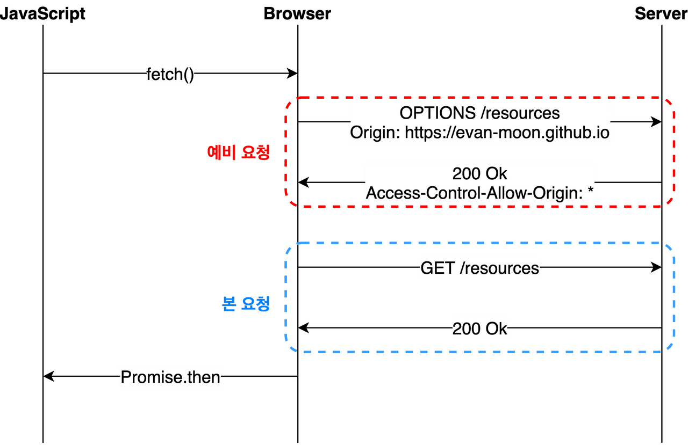

# CORS란?

-   Cross-Origin-Resource-Sharing (교차-출처-리소스-공유)
-   한 도메인이 다른 도메인의 리소스에 엑세스할 수 있게 해주는 보안 메커니즘
-   출처를 비교하는 로직은 서버단이 아니라 **브라우저** 단에서 이루어짐
-   최신 브라우저에서 구현된 **동일 출처 정책** 때문에 등장

> **동일 출처정책**

-   동일한 출처의 리소스 (동일한 프로토콜, 호스트명,포트가 같다는 소리) 에서만 접근할 수 있도록 제한하는 정책

> **Origin(출처)**

-   console.location.origin 하면 localhost300 번 뜸
-   서버 위치를 찾기 위한 가장 기본적인 것들

## CORS의 기본적인 작동원리

1. 웹에서 http 프로토콜을 사용하여 다른 출처로 리소스 요청, 이때 origin 필드에 요청보내는 출처를 담는다.
2. 서버가 응담헤더인 Access-Control-Allow-Origin에 리소스접근이 허용된 출처를 같이 보내줌 (응답).
3. 응답을 받은 브라우저가 자신이 보낸 origin 과 access-control-allow-origin 를 비교한다음 응답이 유효한지 판단.

## 종류에 따른 CORS의 동작방식

### Preflight Request

-   가장 빈번하게 일어나는 cors
-   브라우저는 기본적으로 요청을 예비요청 후에 본요청을 보내는데 이때 예비요청은 본요청을 보내기전 브라우저가 이 요청을 보내도 안전한지 판단.
-   예비요청의 성공여부가 아니라 응답헤더에 응답받은 Aceess-Control-Allow-Origin이 유효한가를 기준으로 판별.
-   응답헤더에 제대로 있기만 하면 cors에러 X

### Simple-Request

-   예비 요청 없이 바로 본요청 , 로직은 preflight 와 같음
-   아래의 조건에서만 예비요청 없이 본요청 보내기 가능.

> ✔️ 조건
>
> 1. 요청의 메소드는 get, head, post 중 하나
> 2. Accept, Accept-Language, Content-Language, Content-Type, DPR, Downlink, Save-Data, Viewport-Width, Width를 제외한 헤더를 사용하면 안된다.
> 3. 만약 Content-Type를 사용하는 경우에는 application/x-www-form-urlencoded, multipart/form-data, text/plain만 허용된다.

### Credentialed Request

-   다른 출처 간 통신에서 보안을 강화하고 싶을때
-   별도 옵션 없이 쿠키나 인증관련된 헤더를 요청에 담지X

> ✔️ 옵션
> same-Origin) 같은출처간 요청만 인증정보 담음
> include) 모든요청에 인증정보 담음
> omit) 모든요청에 인증정보 담지않음

## CORS에러 해결방법

1. 서버에서 해결하기-서버측

-   응답해더에 유효한 값을 포함해서 달라고 요청하기

2. 프록시 서버 사용하기 -프론트엔드측

-   프록시 서버는 클라이언트가 프록시 서버 자신을 통해서 다른 네트워크 서비스에 간접적으로 접속할 수 있게 해준다.
